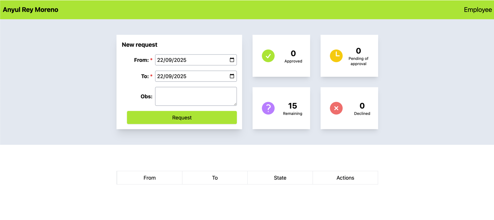
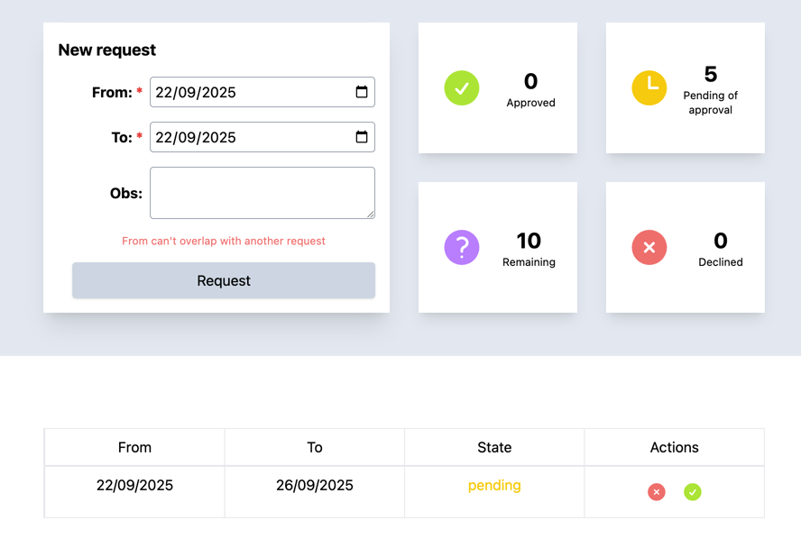
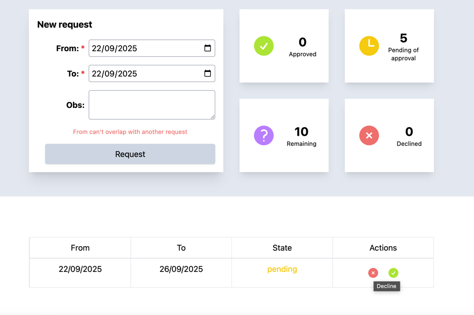
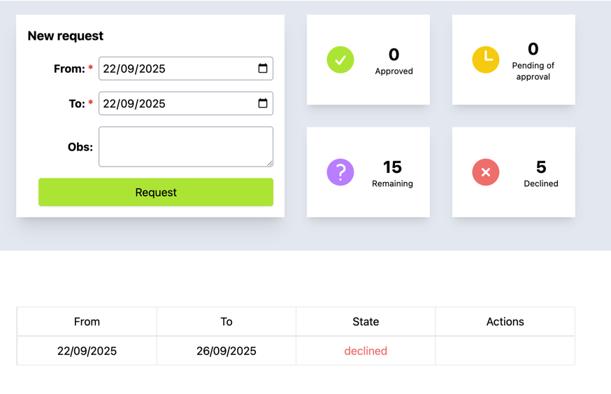

# Prueba técnica – Componente de Vacaciones (React + SCSS)

Vacations App es una aplicación sencilla para gestionar solicitudes de vacaciones. Permite crear nuevas solicitudes, revisar su estado y visualizar de forma clara el balance de días disponibles mediante contadores dinámicos. Su objetivo es facilitar a las personas usuarias el control de sus días de descanso, reduciendo errores y ofreciendo una experiencia organizada y fácil de usar.

## Estructura del proyecto

```
    ├── README.md
    ├── eslint.config.js
    ├── index.html
    ├── package.json
    ├── postcss.config.cjs -> Generado llms
    ├── vite.config.js -> Modificado llms
    ├── .prettierrc -> Generado llms
    ├── llm/
    │   ├── agents/
    │   │   └── frontend-developer.md -> Agente llm (no se utilizó)
    │   └── commands/
    │       └── configure-vite-project.md
    │       └── manage-server-state.md
    │       └── structure-styles.md
    └── src/
        ├── App.jsx
        ├── main.jsx
        ├── componentes/
        │   ├── Layout.jsx
        │   ├── Vacations.jsx
        │   ├── common/ -> Sugerido llms
        │   │   └── Icon.jsx
        │   ├── Counters/
        │   │   ├── Counter.jsx
        │   │   └── Counters.module.scss
        │   ├── RequestForm/
        │   │   ├── RequestForm.jsx
        │   │   └── RequestForm.module.scss
        │   ├── RequestItem/
        │   │   ├── RequestItem.jsx
        │   │   └── RequestItem.module.scss
        │   └── RequestList/
        │       ├── RequestList.jsx
        │       └── RequestList.module.scss
        ├── context/ -> Estado de la aplicación
        │   └── AppContext.jsx
        ├── data/ -> Simulación de data en servidor
        │   └── data.js
        ├── hooks/ -> Persistencia + Estado de servidor
        │   └── useVacations.js
        ├── styles/ -> Sugerido, estilos globales chatgpt
        │   └── globals.scss

```

## Inicio del proyecto

- Ejecutar el comando `pnpm install && pnpm dev`. También podría utilizarse `npm install && npm run dev`.
- Podrá navegar a url que se marca la consola y verá esta pantalla 
- Podrá registrar una nueva solicitud y verá cómo se actualizan todos los valores de la pantalla. 
- Así mismo, podrá interactuar con las acciones y verá cómo se actualizan los valores de la pantalla. 

## Suposiciones

- Tiene sentido que esto tenga varios usuarios y varios roles de usuarios. Alguien que aprueba y deniegue, alguien que administra los usuarios, empleados y el sistema. Por eso, se asume un `currentUser` que está en código escrito
- En un sistema normal tendríamos que validar también vacaciones del año en curso y no confundir con otro año. Para esto, sería crucial la fecha `createdAt`. No se hizo por tiempo y solo se asume.

## Decisiones técnicas

Esta son todas las decisiones que se toman por velocidad y por elegir los puntos a demostrar, sabiendo cómo están las coss.

### Herramientas

- Utilizar `tailwindcss` para hacer los estilos de una manera mas sencilla, es algo que apliqué en proyectos / templates anteriores.
- Hacer uso del concepto `Estado del servidor`. Esto, con ayuda de `React Query` facilitó que se tenga que manipular o transportar estados entre componentes, simplificando las operaciones de consulta / actualización. Además de quitar peso en la carga.
- Usar `uuid` para generar id dinámico de un registro. Esto, cómo sugerencia de llms.
- No hacer uso de paquetes para formularios o tablas. Al no tener experiencia en esto, preferí manejarlo nativo y con esto sacrificar algunas funcionalidad como filtrado y búsqueda.
- Hacer uso de `dayjs` para las operaciones con fechas, formatos y todo lo relacionado.

### Configuraciones

- Usar `tailwindcss` adentro de módulos de sass. Esto, es una sugerencia directa de llms para minimizar los estilos en lines dentro de los componentes.
- prettierrc. Fue recomendado por llms para el formatico del código.

### Código

- Crear un componente `layout` para tener algo similar a un estilo global, al igual que un `global.scss` para estilos globales cómo titulos y otros tags html.
- Crear todo el componente en `Vacations.jsx` porque, la aplicación podría tener administración de usuarios o distintos roles, por lo cual tendría sentido tener diferentes componentes por rol.
- Las validaciones del formulario, se hacen al hacer cualquier cambio, deshabilitando el botón principal. Con esto y mensajes de error, puede ser mejor que validar al enviar, porque puede ser confuso para el usuario, además de comlicar las operaciones.
- El componente `Icon.jsx` sale de la recomendación de hacer liviano el proyecto. Una libreria podría no serlo, así que se han tomado los svg y se han métido, validando que quieres ver

* Crear un contexto `appContext` para manejar el estado de toda la aplicación. En este caso `currentUser`

### Funcional

- Debería ser necesario validar si los días tomados, tienen festivos o fines de semana. Es posible hacerlo, recorriendo los días en una solicitud y validando si el día está dentro de los días de fiesta o fin de semana. Pero lo dejé por ahora.

- Existen distintos usuarios. Por ahora se asume nuestro usuario para la prueba y trabajar con sus datos.
